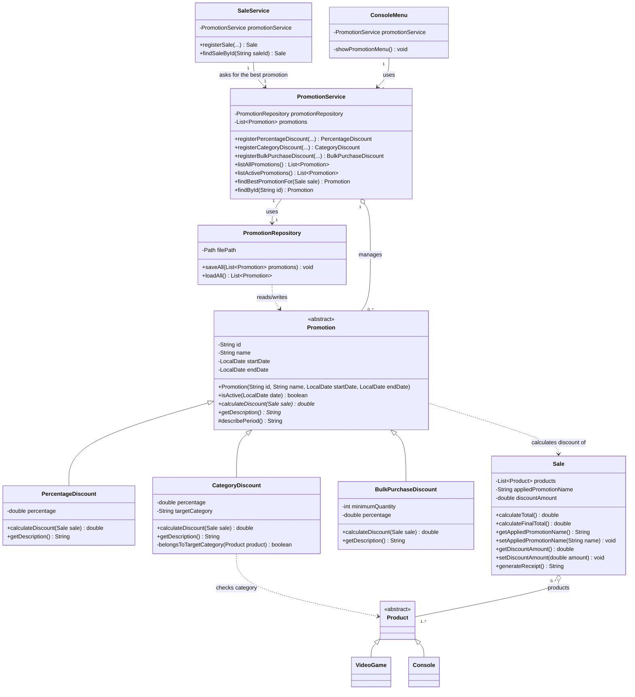

# Promotion Class Diagram - Requirement 2

```mermaid
classDiagram
    direction TB

    class Promotion {
        <<abstract>>
        -String id
        -String name
        -LocalDate startDate
        -LocalDate endDate
        +Promotion(String id, String name, LocalDate startDate, LocalDate endDate)
        +isActive(LocalDate date) boolean
        +calculateDiscount(Sale sale)* double
        +getDescription()* String
        #describePeriod() String
    }
    class PercentageDiscount {
        -double percentage
        +calculateDiscount(Sale sale) double
        +getDescription() String
    }
    class CategoryDiscount {
        -double percentage
        -String targetCategory
        +calculateDiscount(Sale sale) double
        +getDescription() String
        -belongsToTargetCategory(Product product) boolean
    }
    class BulkPurchaseDiscount {
        -int minimumQuantity
        -double percentage
        +calculateDiscount(Sale sale) double
        +getDescription() String
    }
    class Sale {
        -List~Product~ products
        -String appliedPromotionName
        -double discountAmount
        +calculateTotal() double
        +calculateFinalTotal() double
        +getAppliedPromotionName() String
        +setAppliedPromotionName(String name) void
        +getDiscountAmount() double
        +setDiscountAmount(double amount) void
        +generateReceipt() String
    }
    class Product {
        <<abstract>>
    }
    class VideoGame
    class Console
    class PromotionRepository {
        -Path filePath
        +saveAll(List~Promotion~ promotions) void
        +loadAll() List~Promotion~
    }
    class PromotionService {
        -PromotionRepository promotionRepository
        -List~Promotion~ promotions
        +registerPercentageDiscount(...) PercentageDiscount
        +registerCategoryDiscount(...) CategoryDiscount
        +registerBulkPurchaseDiscount(...) BulkPurchaseDiscount
        +listAllPromotions() List~Promotion~
        +listActivePromotions() List~Promotion~
        +findBestPromotionFor(Sale sale) Promotion
        +findById(String id) Promotion
    }
    class SaleService {
        -PromotionService promotionService
        +registerSale(...) Sale
        +findSaleById(String saleId) Sale
    }
    class ConsoleMenu {
        -PromotionService promotionService
        -showPromotionMenu() void
    }

    Promotion <|-- PercentageDiscount
    Promotion <|-- CategoryDiscount
    Promotion <|-- BulkPurchaseDiscount
    Product <|-- VideoGame
    Product <|-- Console

    Promotion ..> Sale : calculates discount of
    CategoryDiscount ..> Product : checks category
    Sale "0..*" o-- "1..*" Product : products
    PromotionRepository ..> Promotion : reads/writes
    PromotionService "1" --> "1" PromotionRepository : uses
    PromotionService "1" o-- "0..*" Promotion : manages
    SaleService "1" --> "1" PromotionService : asks for the best promotion
    ConsoleMenu "1" --> "1" PromotionService : uses
```

`Sale` stores only the name and the amount of the applied promotion, so the
model has no dependency from `Sale` to `Promotion`.
