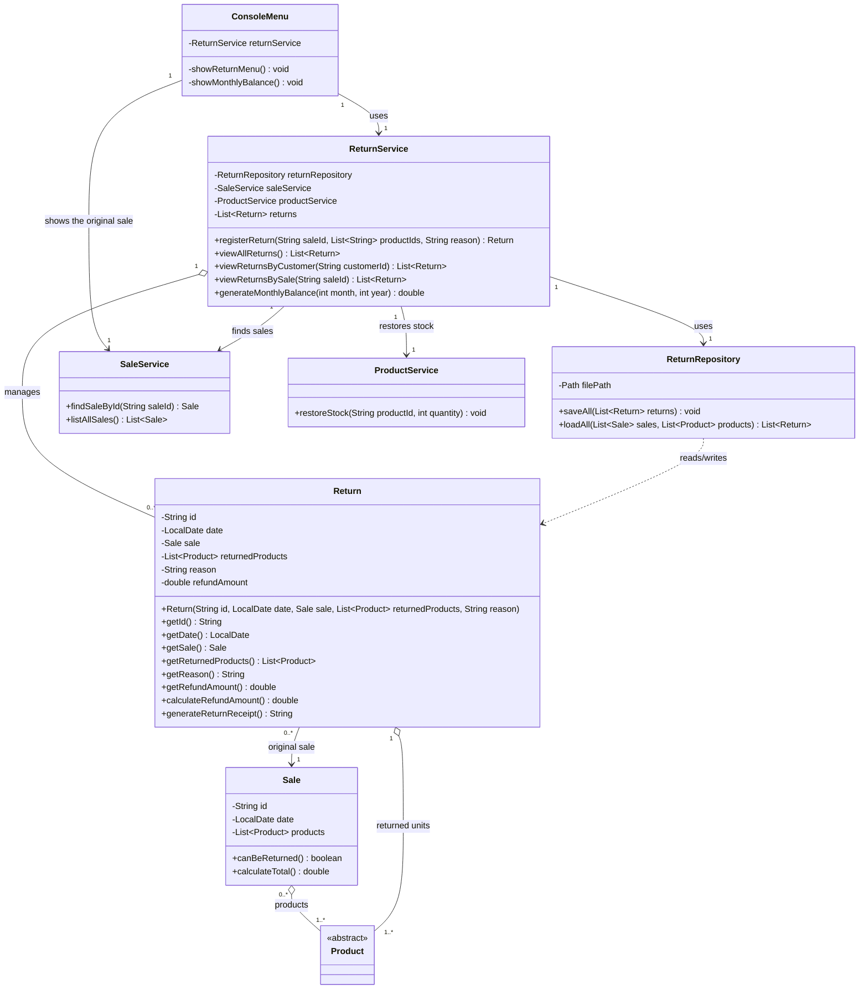

# Return Class Diagram - Requirement 3

```mermaid
classDiagram
    direction TB

    class Return {
        -String id
        -LocalDate date
        -Sale sale
        -List~Product~ returnedProducts
        -String reason
        -double refundAmount
        +Return(String id, LocalDate date, Sale sale, List~Product~ returnedProducts, String reason)
        +getId() String
        +getDate() LocalDate
        +getSale() Sale
        +getReturnedProducts() List~Product~
        +getReason() String
        +getRefundAmount() double
        +calculateRefundAmount() double
        +generateReturnReceipt() String
    }
    class Sale {
        -String id
        -LocalDate date
        -List~Product~ products
        +canBeReturned() boolean
        +calculateTotal() double
    }
    class Product {
        <<abstract>>
    }
    class ReturnRepository {
        -Path filePath
        +saveAll(List~Return~ returns) void
        +loadAll(List~Sale~ sales, List~Product~ products) List~Return~
    }
    class ReturnService {
        -ReturnRepository returnRepository
        -SaleService saleService
        -ProductService productService
        -List~Return~ returns
        +registerReturn(String saleId, List~String~ productIds, String reason) Return
        +viewAllReturns() List~Return~
        +viewReturnsByCustomer(String customerId) List~Return~
        +viewReturnsBySale(String saleId) List~Return~
        +generateMonthlyBalance(int month, int year) double
    }
    class SaleService {
        +findSaleById(String saleId) Sale
        +listAllSales() List~Sale~
    }
    class ProductService {
        +restoreStock(String productId, int quantity) void
    }
    class ConsoleMenu {
        -ReturnService returnService
        -showReturnMenu() void
        -showMonthlyBalance() void
    }

    Return "0..*" --> "1" Sale : original sale
    Return "1" o-- "1..*" Product : returned units
    Sale "0..*" o-- "1..*" Product : products
    ReturnRepository ..> Return : reads/writes
    ReturnService "1" --> "1" ReturnRepository : uses
    ReturnService "1" --> "1" SaleService : finds sales
    ReturnService "1" --> "1" ProductService : restores stock
    ReturnService "1" o-- "0..*" Return : manages
    ConsoleMenu "1" --> "1" ReturnService : uses
    ConsoleMenu "1" --> "1" SaleService : shows the original sale
```
