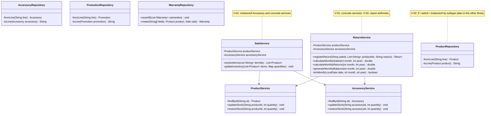

# SOLID Class Diagrams - Requirement 8

## Before the correction

```mermaid
classDiagram
    direction TB

    class SaleService {
        -ProductService productService
        -AccessoryService accessoryService
        -resolveItems(List~String~ itemIds) List~Product~
        -updateInventory(List~Product~ items, Map quantities) void
    }
    note for SaleService "V-01: instanceof Accessory and concrete services"
    class ReturnService {
        -ProductService productService
        -AccessoryService accessoryService
        +registerReturn(String saleId, List~String~ productIds, String reason) Return
        +calculateMonthlySales(int month, int year) double
        +calculateMonthlyReturns(int month, int year) double
        +generateMonthlyBalance(int month, int year) double
        -isInMonth(LocalDate date, int month, int year) boolean
    }
    note for ReturnService "V-01: concrete services; V-03: report arithmetic"
    class ProductService {
        +findById(String id) Product
        +updateStock(String productId, int quantity) void
        +restoreStock(String productId, int quantity) void
    }
    class AccessoryService {
        +findById(String id) Accessory
        +updateStock(String accessoryId, int quantity) void
        +restoreStock(String accessoryId, int quantity) void
    }
    class ProductRepository {
        -fromLine(String line) Product
        -toLine(Product product) String
    }
    class AccessoryRepository {
        -fromLine(String line) Accessory
        -toLine(Accessory accessory) String
    }
    class PromotionRepository {
        -fromLine(String line) Promotion
        -toLine(Promotion promotion) String
    }
    class WarrantyRepository {
        +saveAll(List~Warranty~ warranties) void
        -create(String[] fields, Product product, Sale sale) Warranty
    }
    note for ProductRepository "V-02: if / switch / instanceof by subtype (also in the other three)"

    SaleService --> ProductService
    SaleService --> AccessoryService
    ReturnService --> ProductService
    ReturnService --> AccessoryService
```

## After the correction

```mermaid
classDiagram
    direction TB

    class InventoryService {
        <<interface>>
        +findById(String id) Product
        +updateStock(String itemId, int quantity) void
        +restoreStock(String itemId, int quantity) void
    }
    note for InventoryService "V-01: abstraction of an inventory"
    class ProductService
    class AccessoryService
    class SaleService {
        -List~InventoryService~ inventories
        -inventoryOf(String itemId) InventoryService
    }
    class ReturnService {
        -List~InventoryService~ inventories
        -MonthlyBalanceCalculator balanceCalculator
        -inventoryOf(String itemId) InventoryService
    }
    class MonthlyBalanceCalculator {
        +calculateSales(List~Sale~ sales, int month, int year) double
        +calculateReturns(List~Return~ returns, int month, int year) double
    }
    note for MonthlyBalanceCalculator "V-03: report arithmetic out of ReturnService"

    class RecordMapper~T~ {
        <<interface>>
        +getTypeCode() String
        +supports(T value) boolean
        +toColumns(T value) String
        +fromFields(String[] fields) T
    }
    note for RecordMapper "V-02: one mapper per subtype"
    class VideoGameRecordMapper
    class ConsoleRecordMapper
    class AccessoryRecordMapper {
        <<abstract>>
    }
    class ControllerRecordMapper
    class CableRecordMapper
    class MemoryRecordMapper
    class PercentageDiscountRecordMapper
    class CategoryDiscountRecordMapper
    class BulkPurchaseDiscountRecordMapper
    class WarrantyRecordMapper {
        <<interface>>
        +getTypeCode() String
        +supports(Warranty warranty) boolean
        +create(String id, Product product, Sale sale, LocalDate startDate) Warranty
    }
    class BasicWarrantyRecordMapper
    class ExtendedWarrantyRecordMapper
    class ProductRepository
    class AccessoryRepository
    class PromotionRepository
    class WarrantyRepository

    InventoryService <|.. ProductService
    InventoryService <|.. AccessoryService
    SaleService --> InventoryService
    ReturnService --> InventoryService
    ReturnService --> MonthlyBalanceCalculator
    RecordMapper <|.. VideoGameRecordMapper
    RecordMapper <|.. ConsoleRecordMapper
    RecordMapper <|.. AccessoryRecordMapper
    AccessoryRecordMapper <|-- ControllerRecordMapper
    AccessoryRecordMapper <|-- CableRecordMapper
    AccessoryRecordMapper <|-- MemoryRecordMapper
    RecordMapper <|.. PercentageDiscountRecordMapper
    RecordMapper <|.. CategoryDiscountRecordMapper
    RecordMapper <|.. BulkPurchaseDiscountRecordMapper
    WarrantyRecordMapper <|.. BasicWarrantyRecordMapper
    WarrantyRecordMapper <|.. ExtendedWarrantyRecordMapper
    ProductRepository --> RecordMapper
    AccessoryRepository --> RecordMapper
    PromotionRepository --> RecordMapper
    WarrantyRepository --> WarrantyRecordMapper
```

The constructors of `SaleService` and `ReturnService` keep their parameters,
so `Main` did not change.
